#### Activating LLMOps - automating everything

In this lab, we will build atop of the concepts covered in the previous labs to create a sample LLMOps workflow using an example PromptFlow.

The focus will be on building out two example pipelines that test an orchestration flow when changes have been made in a PR, run an evaulation flow for said orchestration flow before awaiting manual approval for the flow to be approved to a web app.

#### Prerequisites

- An Azure OpenAI resource, within which there is a GPT-35-Turbo PAYGO model deployed called `GPT-35-Turbo`,
- An Azure AI Hub, within which there is an AI project - the project will need the `Reader` RBAC role over the Hub's associated storage account. As well as this, the above Azure OpenAI resource should be added as connection to the Hub - the connection should be called `aoai`,
- An Azure Container Registry resource,
- A service principle with the owner role at the subscription scope - see [here](https://learn.microsoft.com/en-us/cli/azure/azure-cli-sp-tutorial-1?tabs=bash#create-a-service-principal-with-role-and-scope). Note, the output of this will need to be used later when creating the service connection in Azure DevOps,
- An Azure DevOps organisation and project. Note that new organisations will need to request a free gran of parallel jobs as per [here](https://learn.microsoft.com/en-us/azure/devops/pipelines/licensing/concurrent-jobs?view=azure-devops&tabs=ms-hosted#microsoft-hosted-cicd),
- VS Code and Git installed locally.

#### Setup

1. Azure DevOps service connection.

Create a service connection named `azure_connection` in Azure DevOps. You can use [this document](https://learn.microsoft.com/en-us/azure/devops/pipelines/library/service-endpoints?view=azure-devops&tabs=yaml) as a reference. Use Azure Resource Manager as a type of the service connection. 

From your Azure DevOps project, select `Project Settings -> Service connections -> New Service connection -> Azure 
Resource Manager -> Service Principal (manual)`. Fill the form with relevant data related to Service Principal, test 
and save the connection with the name `azure_connection` (it is used in the pipelines in this repo). Note: Service principal key is `clientSecret` field from the Service principal configs.

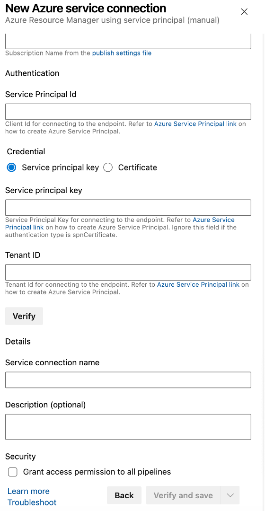

2. Create an Azure DevOps variable group.

Create a new variable group `llmops_platform_dev_vg` ([follow the documentation](https://learn.microsoft.com/en-us/azure/devops/pipelines/library/variable-groups?view=azure-devops&tabs=classic)) with the following variables:

- **AZURE_RM_SVC_CONNECTION**: the name of service connection created in previous step,
- **rg_name**: Name of the resource group containing the Azure AI Hub,
- **ws_name**: Name of the Azure AI Project,
- **kv_name**: Name of the Key Vault associated with the Azure AI Hub.
- **DOCKER_IMAGE_REGISTRY**: A JSON object cotaning the following information:

```json
[
	{
		"registry_name" : "xxxxxxxx",
		"registry_server" : "xxxx.azurecr.io",
		"registry_username" : "xxxxxxxxx",
		"registry_password": "xxxxxxxxxxxxxx"
	}
]

```

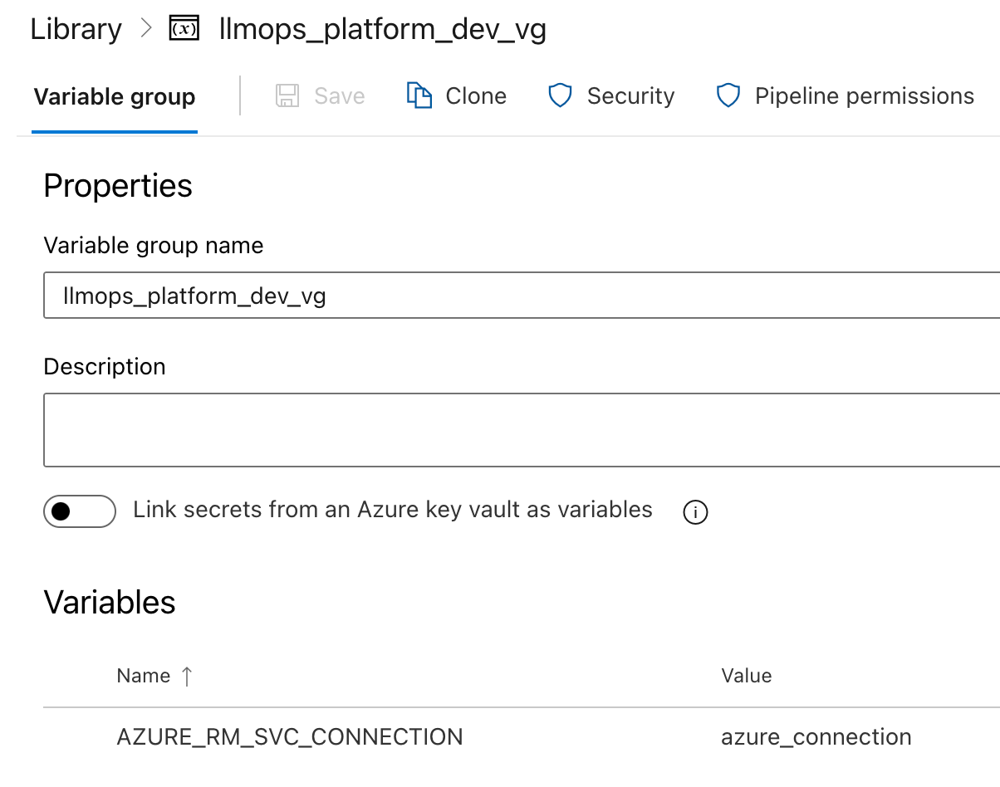

3. Setup environment variables.

Create another Azure DevOps variable within variable group named 'ENV_VARS'. This will house all the connection keys needed for the flow. For this repo, we will need one variable for the key of the AOAI service that is connected to our AI Hub - this is so when the Docker image is built, we can read the key and create the connection.

```bash
AOAI_API_KEY=xxxxxxxxxxxx
```

4. Import this repository into the Azure DevOps project.

Guide can be found [here.](https://learn.microsoft.com/en-us/azure/devops/repos/git/import-git-repository?view=azure-devops)

5. Set the default branch.

Set the development branch as the default branch, the guide for which can be found [here.](https://learn.microsoft.com/en-us/azure/devops/repos/git/change-default-branch?view=azure-devops)

6. Pipeline setup.

 [Create two Azure Pipelines](https://learn.microsoft.com/en-us/azure/devops/pipelines/create-first-pipeline?view=azure-devops&tabs) for the named_entity_recognition scenario. Both Azure Pipelines should be created based on existing YAML files:

  - The first one is based on the [named_entity_recognition_pr_dev_pipeline.yml](./named_entity_recognition/.azure-pipelines/named_entity_recognition_pr_dev_pipeline.yml), and it helps to maintain code quality for all PRs including integration tests for the Azure ML experiment. Usually, we recommend to have a toy dataset for the integration tests to make sure that the Prompt flow job can be completed fast enough - there is not a goal to check prompt quality and we just need to make sure that our job can be executed. 

  - The second Azure Pipeline is based on [named_entity_recognition_ci_dev_pipeline.yml](./named_entity_recognition/.azure-pipelines/named_entity_recognition_ci_dev_pipeline.yml) is executed automatically once new PR has been merged into the *development* or *main* branch. The main idea of this pipeline is to execute bulk run, evaluation on the full dataset for all prompt variants. Both the pipelines can be modified and extended based on the project's requirements.

These following steps should be executed twice - once for PR pipeline and again for CI pipeline.
  
  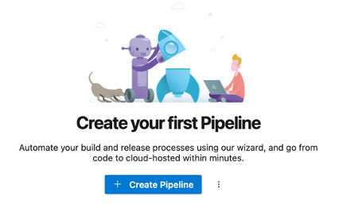
  
In resultant page, select the location of the code - select `Azure Repos Git`
  
  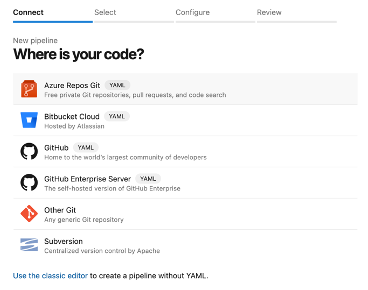
  
In next page, select the repository. There should be only visible repository.   
  
  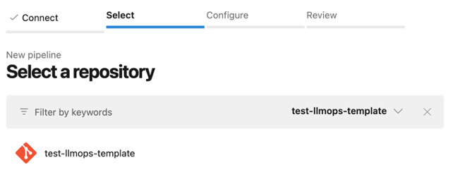

Select `Existing Azure Pipeline YAML file` from resultant page.

  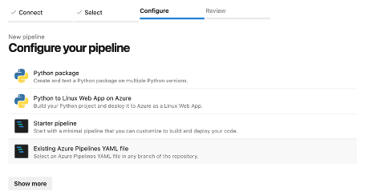
  
select the CI yaml file `named_entity_recognition_ci_dev_pipeline.yml` for named_entity_recognition scenario from the `development` branch.
  
  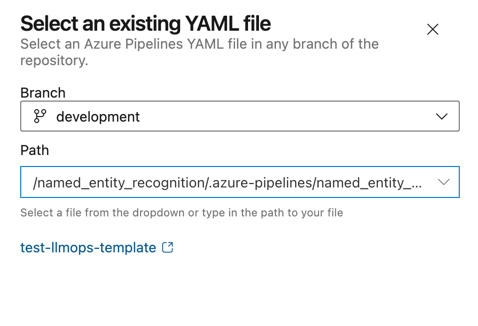

Save the new pipeline.
  
  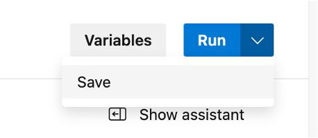
  
Rename the saved pipeline as `named-entity-ci`.

  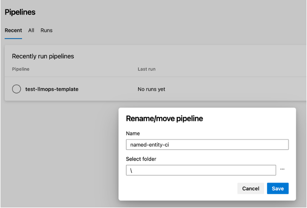
  
Perform the same steps as before for PR pipeline and name it `named-entity-pr`. By the end of this step both the CI and PR pipeline for named_entity_recognition should be available in the Azure DevOps repository.

7. Setup a branch policy.
 
 For this step, we need to setup a branch policy for the *development* branch. At this stage we have an Azure Pipeline that should be executed on every PR to the *development* branch. At the same time successful completion of the build is not a requirement. So, it's important to add our PR build as a policy. Pay special attention that [named_entity_recognition_pr_dev_pipeline.yml](./named_entity_recognition/.azure-pipelines/named_entity_recognition_pr_dev_pipeline.yml) has various paths in place. We are using these paths to limit number of runs if the current PR doesn't affect ML component (for example, PR modifies a documentation file). Therefore, setting up the policy you need to make sure that you are using the same set of paths in the *Path filter* field.

From your Azure DevOps project, select `Repos -> Branches -> more options button against development branch -> Branch policies -> Build validation` and fill the form using the appropriate PR pipeline.

  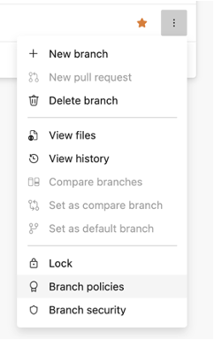
  
  
  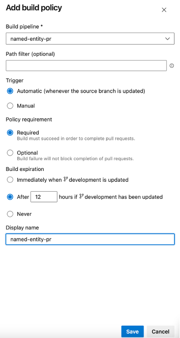

More details about how to create a policy can be found [here](https://learn.microsoft.com/en-us/azure/devops/repos/git/branch-policies?view=azure-devops&tabs=browser).

#### Lab Steps